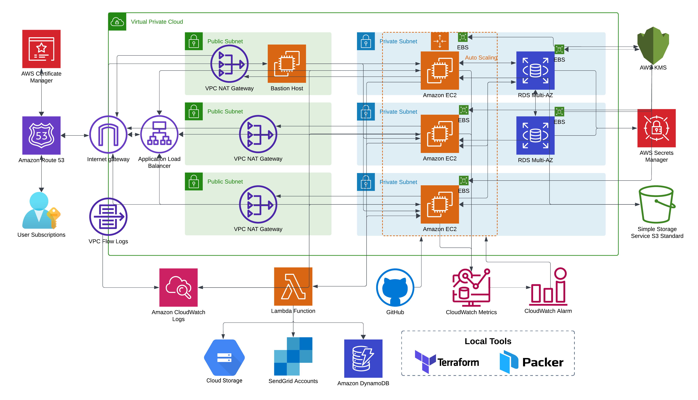

**<h1>ProductSphere - Highly Scalable & Simple Product Management System </h1>**

## Architecture Diagram


## Description
ProductSphere is a Node.js-based web application designed to simplify product management and user authentication. Built with Express.js and powered by a MySQL database, ProductSphere allows users to create, manage, and update product information with ease. It also enables users to securely upload product images, associate them with products, and manage user information.

With API endpoints designed for seamless interaction, ProductSphere is perfect for developers looking to integrate product management into their applications or explore how a backend system works with user authentication, database operations, and file handling.

## Table of Contents
- [Features](#features)
- [Technology Stack](#technology-stack)
- [Prerequisites](#prerequisites)
- [Build & Deploy Instructions](#build--deployment-instructions)
    - [Build an Amazon Machine Image (AMI) using Packer](#build-an-amazon-machine-image-ami-using-packer)
    - [Deploy Infrastructure using Terraform](#deploy-infrastructure-using-terraform)
- [API Endpoints](#api-endpoints)
- [CI/CD Pipeline](#ci-cd-pipeline)
- [Application Logs & Metrics](#application-logs--metrics)
- [Libraries Used](#libraries-used)
- [Repositories](#repositories)

## Features:
- User Management: Create, update, and retrieve user information.
- Product Management: Add, update, retrieve, and delete product details such as name, description, SKU, and quantity.
- Image Management: Upload images associated with products, retrieve images, and manage them efficiently.
- Health Check: A simple health check API to monitor the status of the application.

ProductSphere is a powerful and flexible tool for learning or deploying product and user management systems with modern Node.js architecture and robust cloud infrastructure on AWS.

## Technology Stack
- **Backend Technology:** Node.js
- **Framework:** Express.js
- **Database:** MySQL

## Prerequisites
Ensure you have the following software installed on your system:
- [Git](https://git-scm.com/)
- [Visual Studio Code](https://code.visualstudio.com/)
- [Postman](https://www.postman.com/)
- [MySQL](https://dev.mysql.com/downloads/installer/)
- [Terraform](https://www.terraform.io/downloads.html)
- [Packer](https://www.packer.io/downloads)
- [AWS CLI](https://aws.amazon.com/cli/)

## Build & Deployment Instructions
### Build an Amazon Machine Image (AMI) using [Packer](https://www.packer.io/)

1. **Install Packer:**  
   Download and install Packer from the official site.

2. **Initialize Packer:**
   ```bash
   packer init
   ```

3. **Validate the AMI configuration:**
   ```bash
   packer validate ami.pkr.hcl
   ```

4. **Build the AMI:**
   ```bash
   packer build ami.pkr.hcl
   ```

   You can customize variables like instance type, region, and profile by using the following command:
   ```bash
   packer build -var 'instance_type=t2.micro' -var 'region=us-east-1' -var 'profile=dev' ami.pkr.hcl
   ```

5. **Deploy the AMI:**
   Once the AMI is created, use it to launch new EC2 instances via the AWS Console or Terraform.

### Deploy Infrastructure using [Terraform:](https://www.terraform.io/)
1. **Initialize Terraform:**
   ```bash
   terraform init
   ```

2. **Preview the infrastructure that will be created:**
   ```bash
   terraform plan
   ```

3. **Apply the infrastructure changes:**
   ```bash
   terraform apply
   ```

4. **Destroy the infrastructure:**
   ```bash
   terraform destroy
   ```

5. **Working with multiple environments:**
   Terraform allows you to create multiple workspaces for different environments (e.g., dev, staging, prod).
   - Create a new workspace:
     ```bash
     terraform workspace new <workspace_name>
     ```
   - Switch to a workspace:
     ```bash
     terraform workspace select <workspace_name>
     ```

## API Endpoints

### Health Check
- **GET:** `/healthz` or `/check`

### User Management
- **Create User:**  
  **POST:** `/v1/user`

- **Get User Info:**  
  **GET:** `/v1/user/:userID`

- **Update User Info:**  
  **PUT:** `/v1/user/:userID`

### Product Management
- **Create Product:**  
  **POST:** `/v1/product`

- **Get Product Info:**  
  **GET:** `/v1/product/:productID`

- **Update Product Info:**  
  **PUT/PATCH:** `/v1/product/:productID`

- **Delete Product:**  
  **DELETE:** `/v1/product/:productID`

### Product Image Management
- **Upload Product Image:**  
  **POST:** `/v1/product/:productID/image`

- **Get All Images of a Product:**  
  **GET:** `/v1/product/:productID/image`

- **Get Specific Image:**  
  **GET:** `/v1/product/:productID/image/:imageID`

- **Delete Image:**  
  **DELETE:** `/v1/product/:productID/image/:imageID`


## CI/CD Pipeline
This project includes a CI/CD pipeline using GitHub Actions:
- **On every merge to the `main` branch:**
  - A new AMI is automatically built.
  - The launch template and auto-scaling group are updated.
  - EC2 instances are refreshed to use the newly created AMI.

## Application Logs & Metrics
### Accessing Logs:
- **Application Logs** are collected using CloudWatch Agent and can be accessed from:
  - AWS Console -> CloudWatch -> Log Groups -> `csye6225/webapp`

### Accessing Metrics:
- **Application Metrics** are collected using StatsD and can be accessed from:
  - AWS Console -> CloudWatch -> All Metrics -> `CWAgent`

## Libraries Used

- **Nodemon:** Automatically restarts the server during development.
- **Bcrypt:** Handles password encryption and security.
- **Express:** Web application framework for Node.js.
- **Joi:** Schema validation library for inputs.
- **MySQL:** Database used for persistent storage.
- **Sequelize:** ORM for managing MySQL database operations.
- **Chai:** Assertion library for testing.
- **Supertest:** Used for testing HTTP requests.
- **sqlite3:** Lightweight, file-based database for development and testing.

## Repositories
### 1. [Infra](https://github.com/productsphere/cloud-infra-terraform)
This repository contains Terraform and other necessary code to set the infrastructure required for the ProductSphere application.

### 2. [WebApp](https://github.com/productsphere/cloud-webapp)
This repository contains the web application code for the ProductSphere web application along with the CI/CD pipeline configuration.